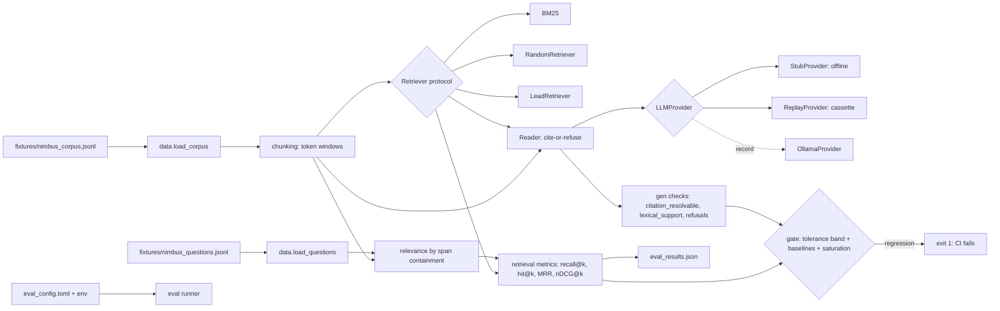

# ailab-rag

[](LICENSE)


A small, local-only, open-source RAG lab where **a number gates CI**. It builds a
retrieve-then-read pipeline over a synthetic corpus, scores retrieval and generation with a
tolerance-band regression gate, and teaches the concepts by running. Change one input
(`chunk_size`, `chunk_overlap`, `top_k`), re-run, and see the consequence in the retrieved
chunks and in the metric.

It keeps `dependencies = []`: BM25 is pure Python, and the live reader uses `urllib` from
the standard library. It is scaffolded from `ailab-template-python` and ports its retrieval
math verbatim from `ailab-evals` (SHAs in [`BUILD_SOURCES.txt`](BUILD_SOURCES.txt) and
[docs/DESIGN.md](docs/DESIGN.md)).

## Quickstart

```bash
make install    # uv sync --locked (Python 3.12, dev tools included)
make lint       # ruff check, ruff format --check, mypy --strict
make test       # pytest with branch coverage (fails under 90%)
make eval       # score the pipeline, write eval_results.json, enforce the gate
make demo       # print the pipeline stages on a few questions, then run the eval
make red        # prove the gate FAILS on 4 sabotages, each naming its metric
make compare    # diff two saved runs that change ONE variable
make lint-docs  # fail on an em dash (U+2014) in docs/
make check-learning-numbers  # assert docs/LEARNING.md figures match the results
make scan       # gitleaks over full history + denylist scan

docker compose up   # build the image and run the demo + eval in a container
```

`ailab-eval` exits `0` when every metric is within the gate band, `1` on a regression
(a metric below its floor minus the tolerance, an unbeaten baseline, a saturated corpus, a
fabricated answer to an unanswerable question, or an unsupported citation), and `2` on a
bad config or dataset. Configuration is layered: defaults, then `eval_config.toml`, then
environment variables, then CLI flags.

| Variable | Default | Purpose |
|---|---|---|
| `AILAB_CORPUS` | `fixtures/nimbus_corpus.jsonl` | Corpus JSONL (`{"id","title","text"}`) |
| `AILAB_QUESTIONS` | `fixtures/nimbus_questions.jsonl` | Golden questions (span-keyed) |
| `AILAB_RETRIEVER` | `bm25` | `bm25`, `random`, or `lead` |
| `AILAB_CHUNK_SIZE` | `32` | Chunk window, in whitespace tokens |
| `AILAB_CHUNK_OVERLAP` | `8` | Overlap between chunks, in whitespace tokens |
| `AILAB_TOP_K` | `5` | Chunks retrieved per question |
| `AILAB_SUPPORT_THRESHOLD` | `0.40` | Cite-or-refuse threshold |
| `AILAB_TOLERANCE` | `0.05` | Gate band below each floor |
| `AILAB_OUTPUT` | `eval_results.json` | Results file |

### Chunk unit

`chunk_size` and `chunk_overlap` are counted in **whitespace tokens**. Changing either
rebuilds the chunk set. Relevance is by **span containment**: a chunk is relevant to a
question when its text contains the question's answer span (case-insensitive, whitespace
normalised). Gold labels therefore stay valid across chunk sizes.

### Results file contract

`eval_results.json` keeps the template's versioned shape (`schema_version: 1`). These
top-level keys are always present; the RAG fields (retriever, dataset shas, baselines,
saturation, refusals, gen checks, misses) are diagnostic extras.

```json
{
  "schema_version": 1,
  "lab": "ailab-rag",
  "dataset": "nimbus_questions",
  "provider": "stub",
  "model": "stub-reader-v1",
  "primary_metric": "recall@5",
  "metrics": {"recall@5": 0.9643, "hit@5": 1.0, "mrr": 0.6726, "ndcg@5": 0.7423, "n": 14},
  "threshold": 0.7,
  "passed": true,
  "commit": "<full git sha, or null>",
  "generated_at": "2026-10-01T00:00:00Z"
}
```

## Architecture



| Path | What lives there |
|---|---|
| `src/ailab_rag/data.py` | Corpus and question loaders, dataset sha256 |
| `src/ailab_rag/chunking.py` | Token chunker, span-containment relevance |
| `src/ailab_rag/retrieval.py` | `Retriever` protocol, BM25, random and lead baselines |
| `src/ailab_rag/metrics.py` | Retrieval metrics ported from ailab-evals |
| `src/ailab_rag/providers.py` | `LLMProvider`, `StubProvider`, `ReplayProvider`, `OllamaProvider` |
| `src/ailab_rag/reader.py` | Cite-or-refuse reader |
| `src/ailab_rag/gen_checks.py` | citation_resolvable, lexical_support, refusal classes |
| `src/ailab_rag/eval.py` | Runner and regression gate (`ailab-eval`) |
| `src/ailab_rag/compare.py` | Diff two saved runs (one changed variable) |
| `fixtures/` | Synthetic data only; provenance in [FIXTURES.md](FIXTURES.md) |
| `scripts/`, `.githooks/`, `.gitleaks.toml` | The secret wall, em-dash and learning-number checks |

## Eval results

Rows are generated from the results file, never typed by hand:

```bash
uv run ailab-eval --table-from eval_results.json
```

| Date | Commit | Retriever | Dataset | chunk | top_k | recall@k | hit@k | mrr | ndcg@k | Notes |
|---|---|---|---|---|---|---|---|---|---|---|
| 2026-10-01 | (local) | bm25 | nimbus_questions (n=14) | 32/8 | 5 | 0.9643 | 1.0000 | 0.6726 | 0.7423 | PASS |
| 2026-10-01 | (local) | bm25 | nimbus_questions (n=14) | 16/8 | 5 | 0.7143 | 0.7143 | 0.4107 | 0.4874 | FAIL (chunks too small) |

See [MODEL_CARD.md](MODEL_CARD.md) for what these numbers do and do not mean, and
[docs/LEARNING.md](docs/LEARNING.md) for the concepts, each with an analogy tied to a real
number from this lab.

## Two saved runs and a diff

`results/run_chunk16.json` and `results/run_chunk32.json` change exactly one variable,
`chunk_size`. `make compare` prints the single changed variable and the metric delta.
Shrinking chunks from 32 to 16 tokens drops recall@5 by 0.25 and the gate rejects the
smaller config. The delta is real, not noise: the corpus includes near-miss unanswerable
questions, distractor documents, and a fact split across a chunk boundary.

## Privacy wall (local only)

This lab is **local only**. v1 has NO GitHub remote and is never pushed. Publishing is a
separate, explicit decision. The data is synthetic (a fictional SaaS named Nimbus) and
carries no real product, support, or personal data. The secret wall still applies:

1. **gitleaks** with [`.gitleaks.toml`](.gitleaks.toml), run by the `pre-push` hook
   (`make hooks`) and the CI `secret-scan` job, over the full history.
2. **Denylist scan** ([`scripts/denylist_scan.sh`](scripts/denylist_scan.sh)): generic
   public patterns are committed; private patterns come from a secret or local file and are
   never committed or printed. The scan fails closed.

## License

[Apache License 2.0](LICENSE). Copyright 2026 Andrew Pyle.
