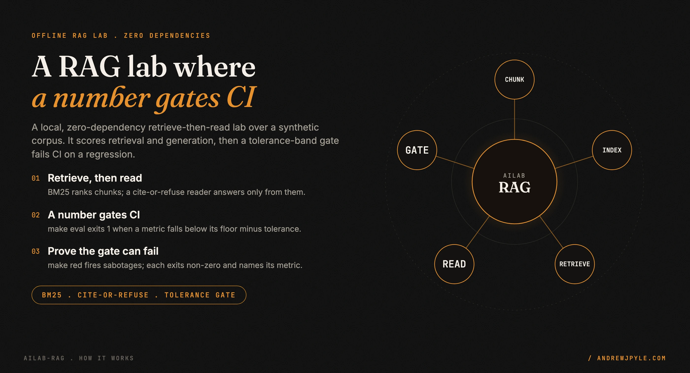
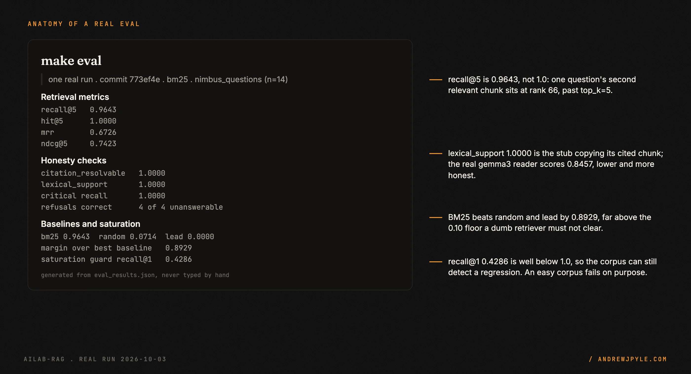
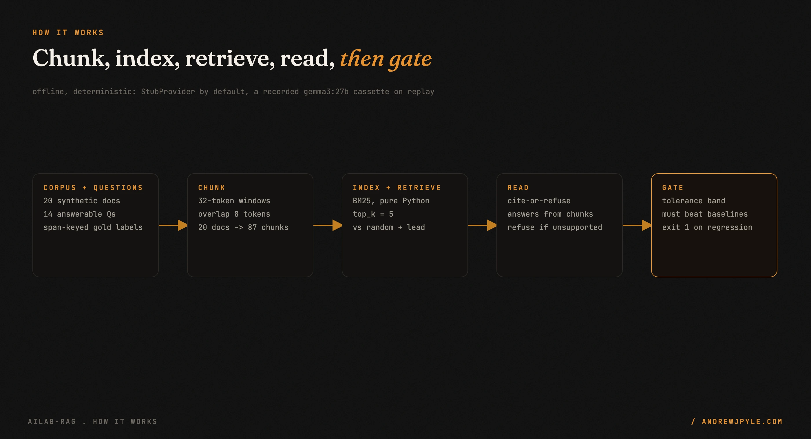
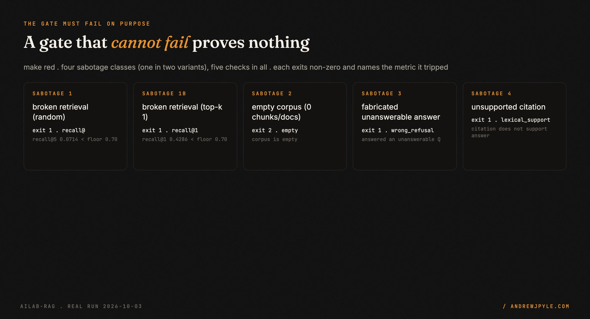

<p align="center">
  
</p>

<p align="center">
  <a href="https://github.com/andrewjpyle/ailab-rag/actions/workflows/ci.yml"></a>
  
  
</p>

# ailab-rag

A small, local, open-source lab for retrieve-then-read RAG, where **a number gates CI**. It
builds a retrieval-then-generation pipeline over a synthetic corpus, scores both halves, and a
tolerance-band regression gate fails the build when a metric drops. You learn the concepts by
running them: change one input, re-run, and watch the retrieved chunks and the metric move.

- **Retrieve, then read.** BM25 ranks chunks; a cite-or-refuse reader answers only from what it retrieved, or refuses.
- **A gate you can trust because you watched it fail.** `make red` fires sabotages and each one must exit non-zero and name the metric it tripped.
- **Honest metrics.** A saturation guard, weak baselines, and a generation check named for exactly what it proves (`citation_resolvable`, not `faithfulness`).
- **Offline and reproducible.** A stub reader by default and a recorded `gemma3:27b` cassette on replay. No network and no key to run the eval.

> **The one idea worth stealing, even if you never run this code:** a test that cannot fail is
> not a test. Before you trust a green gate, prove it can go red. This lab ships `make red`, which
> breaks the pipeline four ways on purpose and fails the build if any sabotage slips through. A
> corpus so easy that recall is 1.0 at `top_k=1` fails the gate for the same reason: a check that
> can never drop can never warn you.

---

## 60 seconds to a scored eval

```bash
make install    # uv sync --locked (Python 3.12, dev tools included)
make eval       # score the pipeline, write eval_results.json, enforce the gate
```

The eval prints a results row and the honesty checks, then exits `0` because every metric is
within its gate band. This is the real output from commit `773ef4e`:

```text
| Date | Commit | Retriever | Dataset | chunk | top_k | recall@k | hit@k | mrr | ndcg@k | Notes |
|---|---|---|---|---|---|---|---|---|---|---|
| 2026-10-03 | 773ef4e | bm25 | nimbus_questions (n=14) | 32/8 | 5 | 0.9643 | 1.0000 | 0.6726 | 0.7423 | PASS |
class n: answerable=14, unanswerable=4, trap=3, critical=5
saturation guard: recall@5=0.9643 recall@1=0.4286 -> ok
baselines: bm25=0.9643 random=0.0714 lead=0.0000 margin=0.8929 (required 0.10)
refusals: correct=4 false_refusal=0 wrong_refusal=0
gen checks: citation_resolvable=1.0000 lexical_support=1.0000 (answered n=14)
critical recall: 1.0000 (n=5)
```

<p align="center"></p>

`make demo` runs the same pipeline on a few questions first, so you can see a retrieval, an
answer with its citation, a refusal on an unanswerable question, and a worked example of a
relevant chunk that falls past the `top_k` cutoff:

```text
corpus: 20 docs -> 87 chunks (chunk_size=32 tok, overlap=8 tok), top_k=5

Q [q01] (answerable): How often does the Nimbus Relay upload changes by default?
    -> ANSWER: ... The Relay batches changes and uploads them every ninety seconds by default ...
       CITES: nimbus-overview#2

Q [u01] (unanswerable): Which telephone hotline issues prorated refund cheques for a storage plan?
    -> REFUSED: I cannot answer this question from the retrieved context.

== worked example: a relevant chunk excluded by the cutoff ==
Q [q07]: What is the minimum part size for a multipart upload to the files endpoint?
    relevant chunk nimbus-api-files#3 is at rank 66, but top_k=5, so it is EXCLUDED.
```

### All the targets

```bash
make lint       # ruff check, ruff format --check, mypy --strict
make test       # pytest with branch coverage (fails under 90%)
make red        # prove the gate FAILS on sabotages, each naming its metric
make compare    # diff two saved runs that change ONE variable
make lint-docs  # fail on an em dash (U+2014) in docs/
make check-learning-numbers  # assert docs/LEARNING.md figures match the results
make scan       # gitleaks over full history + denylist scan

docker compose up   # build the image and run the demo + eval in a container
```

## Configure it

Configuration is layered: defaults, then `eval_config.toml`, then environment variables, then
CLI flags. `ailab-eval` exits `0` when every metric is within the gate band, `1` on a regression
(a metric below its floor minus the tolerance, an unbeaten baseline, a saturated corpus, a
fabricated answer to an unanswerable question, or an unsupported citation), and `2` on a bad
config or dataset.

| Variable | Default | Purpose |
|---|---|---|
| `AILAB_CORPUS` | `fixtures/nimbus_corpus.jsonl` | Corpus JSONL (`{"id","title","text"}`) |
| `AILAB_QUESTIONS` | `fixtures/nimbus_questions.jsonl` | Golden questions (span-keyed) |
| `AILAB_RETRIEVER` | `bm25` | `bm25`, `random`, or `lead` |
| `AILAB_CHUNK_SIZE` | `32` | Chunk window, in whitespace tokens |
| `AILAB_CHUNK_OVERLAP` | `8` | Overlap between chunks, in whitespace tokens |
| `AILAB_TOP_K` | `5` | Chunks retrieved per question |
| `AILAB_SUPPORT_THRESHOLD` | `0.40` | Cite-or-refuse threshold |
| `AILAB_TOLERANCE` | `0.05` | Gate band below each floor |
| `AILAB_OUTPUT` | `eval_results.json` | Results file |

### Chunk unit

`chunk_size` and `chunk_overlap` are counted in **whitespace tokens**. Changing either rebuilds
the chunk set. Relevance is by **span containment**: a chunk is relevant to a question when its
text contains the question's answer span (case-insensitive, whitespace normalised). Gold labels
therefore stay valid across chunk sizes.

### Results file contract

`eval_results.json` keeps the template's versioned shape (`schema_version: 1`). These top-level
keys are always present; the RAG fields (retriever, dataset shas, baselines, saturation, refusals,
gen checks, misses) are diagnostic extras.

```json
{
  "schema_version": 1,
  "lab": "ailab-rag",
  "dataset": "nimbus_questions",
  "provider": "stub",
  "model": "stub-reader-v1",
  "primary_metric": "recall@5",
  "metrics": {"recall@5": 0.9643, "hit@5": 1.0, "mrr": 0.6726, "ndcg@5": 0.7423, "n": 14},
  "threshold": 0.7,
  "passed": true,
  "commit": "<full git sha, or null>",
  "generated_at": "2026-10-01T00:00:00Z"
}
```

## How it works

<p align="center"></p>

The corpus and the span-keyed questions are loaded, chunked into token windows, and indexed by
BM25. For each question the retriever returns `top_k` chunks, retrieval metrics are scored against
the span-containment labels, and a cite-or-refuse reader answers from the retrieved chunks or
refuses. The gate then checks the metrics against explicit floors with a tolerance band, against
weak baselines, and against the saturation and generation honesty checks. A regression exits `1`
and CI fails.

The reader runs behind an `LLMProvider` seam. `StubProvider` is a deterministic, offline format
path, not a real model. `ReplayProvider` serves a committed JSON cassette keyed by
`sha256(model, prompt)`, recorded once from a real `gemma3:27b` (`make record`, opt-in). A cassette
miss raises, so a stale cassette cannot silently pass. Nothing in the default path touches the
network.

| Path | What lives there |
|---|---|
| `src/ailab_rag/data.py` | Corpus and question loaders, dataset sha256 |
| `src/ailab_rag/chunking.py` | Token chunker, span-containment relevance |
| `src/ailab_rag/retrieval.py` | `Retriever` protocol, BM25, random and lead baselines |
| `src/ailab_rag/metrics.py` | Retrieval metrics ported from ailab-evals |
| `src/ailab_rag/providers.py` | `LLMProvider`, `StubProvider`, `ReplayProvider`, `OllamaProvider` |
| `src/ailab_rag/reader.py` | Cite-or-refuse reader |
| `src/ailab_rag/gen_checks.py` | citation_resolvable, lexical_support, refusal classes |
| `src/ailab_rag/eval.py` | Runner and regression gate (`ailab-eval`) |
| `src/ailab_rag/compare.py` | Diff two saved runs (one changed variable) |
| `fixtures/` | Synthetic data only; provenance in [FIXTURES.md](FIXTURES.md) |

It keeps **no third-party runtime dependencies**: BM25 is pure Python and the live reader uses
`urllib` from the standard library. It has one pinned first-party dependency, `ailab-core`,
referenced by an immutable commit SHA for the provider seam and the gate primitive. `ruff`, `mypy`
and `pytest` are dev-only. It is scaffolded from `ailab-template-python` and ports its retrieval
math verbatim from `ailab-evals` (SHAs in [`BUILD_SOURCES.txt`](BUILD_SOURCES.txt) and
[docs/DESIGN.md](docs/DESIGN.md)).

## Prove the gate can fail

A passing gate is only worth something if it could have failed. `make red` breaks the pipeline on
purpose, four ways (one in two variants, five checks in all), and each one must exit non-zero and
name the metric it tripped. If any sabotage slips through, `make red` itself fails.

<p align="center"></p>

```text
== make red: proving the gate fails on each sabotage ==
PASS [1 broken retrieval (random)]: exit 1, named 'recall@'
PASS [1b broken retrieval (top-k 1)]: exit 1, named 'recall@1'
PASS [2 empty corpus (0 chunks/docs)]: exit 2, named 'empty'
PASS [3 fabricated unanswerable answer]: exit 1, named 'wrong_refusal'
PASS [4 unsupported citation]: exit 1, named 'lexical_support'
== all red cases failed the gate as required ==
```

## Two saved runs and a diff

`results/run_chunk16.json` and `results/run_chunk32.json` change exactly one variable,
`chunk_size`. `make compare` prints the single changed variable and the metric delta. Shrinking
chunks from 32 to 16 tokens drops recall@5 by 0.25 and the gate rejects the smaller config. The
delta is real, not noise: the corpus includes near-miss unanswerable questions, distractor
documents, and a fact split across a chunk boundary.

```text
single changed variable: chunk_size: 16 -> 32

metric                A          B      delta
recall@5         0.7143     0.9643    +0.2500
hit@5            0.7143     1.0000    +0.2857
mrr              0.4107     0.6726    +0.2619
ndcg@5           0.4874     0.7423    +0.2549
```

See [MODEL_CARD.md](MODEL_CARD.md) for what these numbers do and do not mean, and
[docs/LEARNING.md](docs/LEARNING.md) for the concepts, each with an analogy tied to a real number
from this lab.

## Scope: what it does not do

- **No dense or embedding retrieval, and no reranking.** v1 is BM25 only, kept dependency-free and auditable. Dense retrieval is a later slice behind the same `Retriever` seam.
- **The stub reader does not read for meaning.** It is a deterministic format path. It refuses a near-miss only because the missing word drops lexical support below the threshold. A real model is needed to refuse a near-miss that shares every word with the corpus.
- **`citation_resolvable` is not faithfulness.** It proves a cited chunk id exists in the retrieved set, nothing more. `lexical_support` is a weak n-gram proxy, not a judgement of meaning.
- **The corpus is synthetic.** It is a fictional SaaS named Nimbus. The numbers describe this lab, not any real retrieval system.
- **No live LLM in CI.** The real model is recorded once and replayed. A live call is opt-in and local.

## The patterns

| Pattern | The failure it prevents |
|---|---|
| Prove the gate can fail (`make red`) | a green check that was never able to go red |
| Tolerance band, not an exact score | a gate that flaps on one noisy example |
| Saturation guard | an easy corpus that hides every regression |
| Weak baselines (random, lead) | a retriever that looks good but barely beats chance |
| Span-containment relevance | gold labels that rot when `chunk_size` changes |
| Cite-or-refuse | a confident answer invented from no source |
| `citation_resolvable`, not `faithfulness` | a metric name that overclaims what it proves |
| Record and replay the real model | a flaky, paid, networked CI run |
| Numbers generated from results, never typed | a hand-edited figure that drifts from the data |

## FAQ

**Does it really have zero dependencies?** No third-party runtime packages. It has one pinned
first-party dependency, `ailab-core`, referenced by an immutable commit SHA. `ruff`, `mypy` and
`pytest` are dev-only tools.

**Does it call an LLM?** Not by default. The stub reader is offline and deterministic. A real
`gemma3:27b` run is recorded once with `make record` and replayed from a committed cassette, so
the eval stays offline and reproducible.

**Is the data real?** No. The corpus is a synthetic, fictional SaaS named Nimbus. It carries no
real product, support, or personal data.

**recall@5 is 0.9643, not 1.0. Is that a bug?** No. One question has a second relevant chunk at
rank 66, past `top_k=5`, so it is excluded. The worked example in `make demo` shows exactly which
question and why.

**Why BM25 and not embeddings?** v1 keeps retrieval dependency-free and the math easy to audit
against its source. Dense retrieval is a planned slice behind the same seam.

## Privacy and the secret wall

The data is synthetic (a fictional SaaS named Nimbus) and carries no real product, support, or
personal data. The secret wall runs on every push:

1. **gitleaks** with [`.gitleaks.toml`](.gitleaks.toml), run by the `pre-push` hook (`make hooks`)
   and the CI `secret-scan` job, over the full history.
2. **Denylist scan** ([`scripts/denylist_scan.sh`](scripts/denylist_scan.sh)): generic public
   patterns are committed; private patterns come from a secret or local file and are never
   committed or printed. The scan fails closed.

## Roadmap

- Dense or embedding retrieval behind the same `Retriever` seam
- A reranking stage between retrieval and the reader
- More datasets beyond the Nimbus corpus, each with its own gold labels
- A second recorded reader model, to compare paraphrase behaviour

## License

[Apache License 2.0](LICENSE). Copyright 2026 Andrew Pyle.
